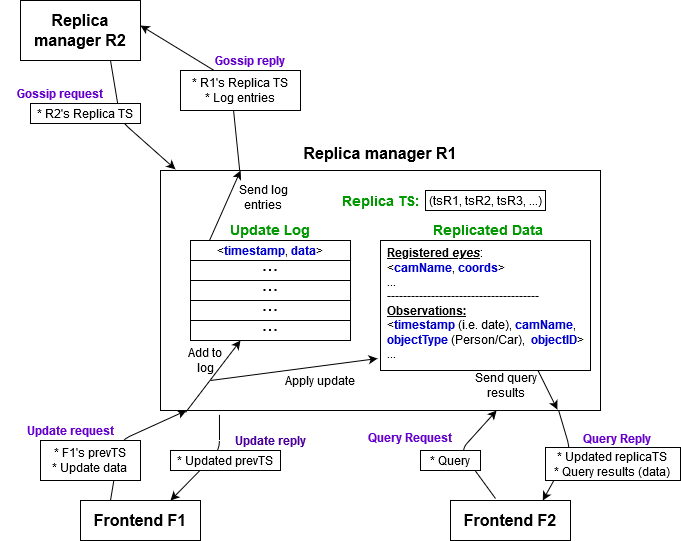
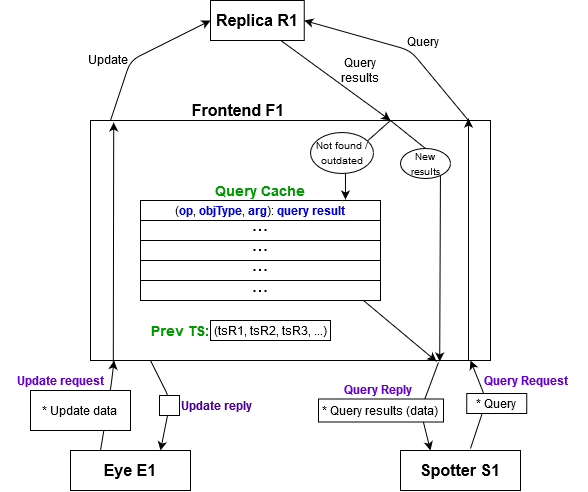

# Sauron project report

Distributed Systems 2019-2020, 2nd semester

## Authors

**Grupo T21**

| Number | Name           | User                                | Email                                           |
| -------|----------------|-------------------------------------| ------------------------------------------------|
| 90714  | Filipe Sousa   | <https://github.com/filipesousaist> | <mailto:filipe.miguel.sousa@tecnico.ulisboa.pt> |
| 90762  | Pedro Vilela   | <https://github.com/pedro19v>       | <mailto:pedro.vilela@tecnico.ulisboa.pt>        |
| 90766  | Pedro Pereira  | <https://github.com/pedro99p>       | <mailto:pedro.l.pereira@tecnico.ulisboa.pt>     |

  

## Corrections to 1st part
- Server now accepts multiple connections from Eye with same name and coordinates (i.e., it does not send an error message anymore).

## Fault model

#### Our solution can has the following fault-tolerance properties:

- When one or more (but not all) servers go down, and come back up, they can recover totally or partially their previous state.

- When the server a client was connected to goes down, the frontend tries to reconnect to a different server.

- **Partition tolerance**: When there is a partition in the network each "sub-network" can function as an autonomous network, although each one of them will evolve independently.

- **Coherent reads by same client**: When a client makes the same query twice, it cannot receive older results in the second query compared to the first one.

#### Our solution cannot handle the following faults:

- When a server goes down and comes back up, and receives updates from a client before a gossip round, the state of the system becomes inconsistent.

- When a server goes down, updates that it received after the last gossip round (before going down) are permanently lost.

- When an Eye connects to a server, and a second Eye connects to a different server with the same name and different coordinates, before the gossiping of the first join to this second server, both eyes are considered registered, and thus the system state becomes inconsistent.

- **Byzantine server faults**: We did not consider the possibility of a server misbehaving.

## Solution

In order to fulfill the requirement of having a high availability and partition tolerant system we used a
a variant of the gossip protocol. The gossip protocol in the project's scenario is used to share information about 
observations and cameras across all server replicas.

Each replica manager (i.e. server) has:
 - a copy of the replicated data;
 - a vector timestamp, containing the number of updates done by each replica manager;
 - an update log to keep track of updates that cannot be executed due to causal dependencies, and also to be able to send these updates in the future to other replicas via gossip.

However, in our case, because there are no causal dependencies between observations and between Eye registrations, the 
update log and the value will always remain consistent with stored data. 
Therefore, one of the changes we made to the original protocol was only having one timestamp per replica manager, while the original protocol had two timestamps: the value timestamp, which represents the state of the update log, and the value timestamp, which represents the state of the replica.

#### Updates
When a replica receives an update request (a report or a cam_join):
 - it tries to insert them first in the replicated data, to check if the received data is valid (it checks if the person or car ids or camera name match the specified format);
 - it inserts the updates in the update log;
 - it increments its own entry in its Replica timestamp;
 - it replaces its own entry in the frontend's Prev TS with its newly-updated entry (computed in the previous step);
 - it sends the updated Prev TS back to the frontend, for it to use on further requests.

#### Queries
When a replica receives a query request (cam_info, track, trackMatch, trace), it searches for what was asked and returns it to the client, along with
its Replica TS.

## Replication protocol

Periodically, a replica will request all other replicas to send it the observations and camera info they have and
provides them with its actual timestamp. The other replicas will send the updates which they know the replica does
not have, by looking at the timestamp the replica sent them. The replica will then update its value (replicated data), its log, 
and its timestamp with the incoming updates. 

This way, we guarantee that the replicas, most of the time, will have the most recent data, thus providing high
availability.

Furthermore, if a replica for some reason goes down (it needed to perform a reset, or the power fails), when it
comes back up, it will quickly be updated with the most recent information. This happens because, when the replica
comes back up, its timestamp will be the zero vector. Then, when it asks the other replicas for updates the other replicas 
will realize that that replica has a very low timestamp and will send it a big chunk of updates. And this way in
one round of gossip messages the replica that just came back up will have the most recent updates. 

## Implementation options

In order to better understand one of the implementation options we chose, let's take a look at the following image, which illustrates the basis of our frontend implementation:

#### The frontend
The frontend has a vector timestamp (Prev TS) which stores how updated is the client in relation to the servers. The value **v** of the entry **i** in the timestamp means that either:
- the Eye has done a report to server **i**, and after it, the server had done a total of **v** updates;
- the Spotter has done a query to a server that already had the **v**th update of server **i** (even if the query was unrelated to that update).

The frontend also has a query cache, which stores the results to the latest queries. The cache size is configurable.

#### Updates
Updates sent by an Eye (mainly observation reports, but also registration requests) go directly to the server, that, as we've seen before, executes it.

#### Queries
Queries are also sent to the server, but when the frontend receives the results it makes a check: it compares the received timestamp with its own timestamp. 

If the received timestamp is newer than (or the same as) its own timestamp, it returns to the client the newer update, and updates the cache accordingly. Otherwise, it just returns to the client the cache contents for that query, if it exists.

## Final notes

We noted that, the fact that there is no persistent data, brought an additional problem because, when a server goes down, its state is lost. So it has to wait for gossips from other servers, in order to recover its data. 
